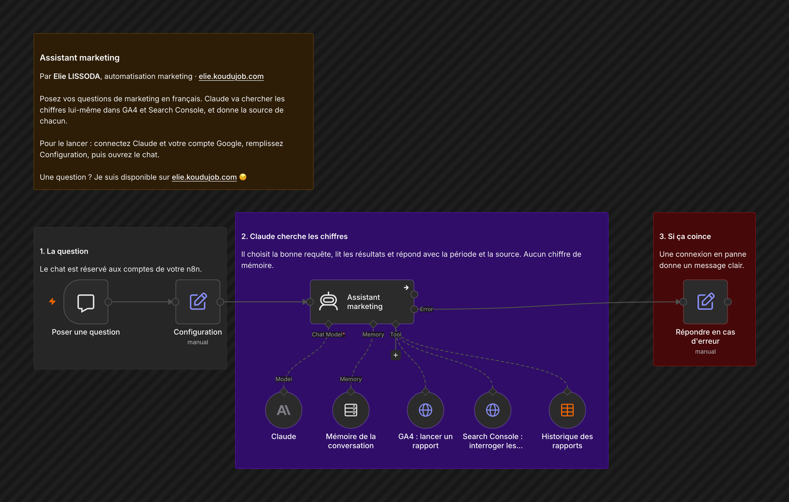

# Assistant marketing

Posez vos questions de marketing en français. Claude va chercher les chiffres lui-même dans GA4 et Search Console, et donne la source de chacun.

## Comment il fonctionne

1. **La question.** Le chat est réservé aux comptes de votre n8n.
2. **Claude cherche les chiffres.** Il choisit la bonne requête, lit les résultats et répond avec la période et la source. Aucun chiffre de mémoire.
3. **Si ça coince.** Une connexion en panne donne un message clair.

## Pour l'installer

1. Créez un identifiant Anthropic, et une connexion Google OAuth2 qui peut lire Analytics et Search Console.
2. Dans Configuration, indiquez votre site, votre propriété GA4 et votre propriété Search Console (par exemple `sc-domain:mamarque.fr`).
3. L'historique vient de la table « Reporting marketing historique », remplie par le [reporting hebdomadaire](../reporting-marketing-hebdo/).
4. Importez `workflow.json`, choisissez la table dans « Historique des rapports », puis ouvrez le chat.

---

Un souci pour l'installer, ou une question ? Je suis disponible sur [elie.koudujob.com](https://elie.koudujob.com) 😉

**Elie LISSODA**
