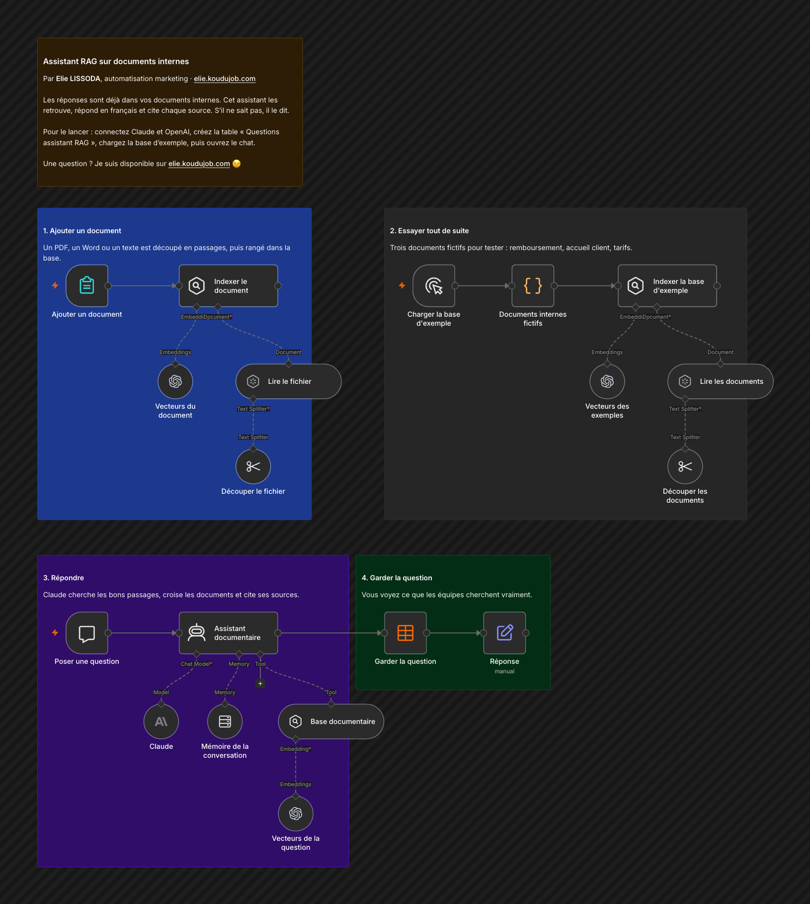

# Assistant RAG sur documents internes

Les réponses sont déjà dans vos documents internes. Cet assistant les retrouve, répond en français et cite chaque source. S'il ne sait pas, il le dit.

## Comment il fonctionne

1. **Ajouter un document.** Un PDF, un Word ou un texte est découpé en passages, puis rangé dans la base.
2. **Essayer tout de suite.** Trois documents fictifs pour tester : remboursement, accueil client, tarifs.
3. **Répondre.** Claude cherche les bons passages, croise les documents et cite ses sources.
4. **Garder la question.** Vous voyez ce que les équipes cherchent vraiment.

Testé sur la base d'exemple : une question qui demandait de croiser deux documents a reçu la bonne réponse, avec les deux sources.

## Pour l'installer

1. Créez un identifiant Anthropic pour les réponses et un identifiant OpenAI pour les vecteurs.
2. Créez la table n8n « Questions assistant RAG » avec les colonnes pose_le, question, reponse, session.
3. Importez `workflow.json`, choisissez votre table, lancez « Charger la base d'exemple », puis ouvrez le chat.
4. En production, la base en mémoire se vide au redémarrage de n8n : remplacez les trois nœuds Simple Vector Store par Supabase, Qdrant ou Pinecone.

---

Un souci pour l'installer, ou une question ? Je suis disponible sur [elie.koudujob.com](https://elie.koudujob.com) 😉

**Elie LISSODA**
