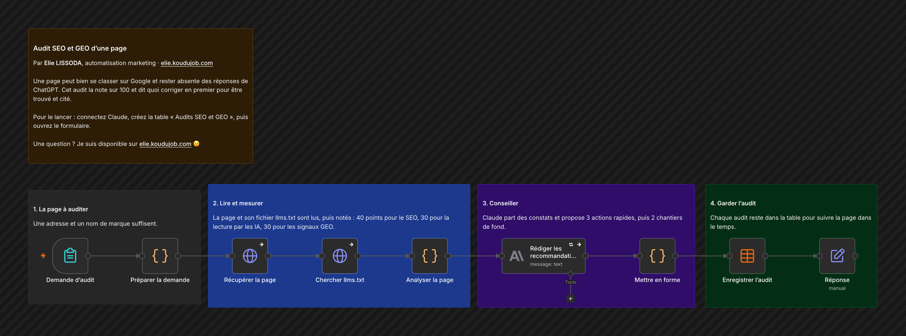

# Audit SEO et GEO d'une page

Une page peut bien se classer sur Google et rester absente des réponses de ChatGPT. Cet audit la note sur 100 et dit quoi corriger en premier pour être trouvé et cité.

## Comment il fonctionne

1. **La page à auditer.** Une adresse et un nom de marque suffisent.
2. **Lire et mesurer.** La page et son fichier llms.txt sont lus, puis notés : 40 points pour le SEO, 30 pour la lecture par les IA, 30 pour les signaux GEO.
3. **Conseiller.** Claude part des constats et propose 3 actions rapides, puis 2 chantiers de fond.
4. **Garder l'audit.** Chaque audit reste dans la table pour suivre la page dans le temps.

## Pour l'installer

1. Créez la table n8n « Audits SEO et GEO » avec les colonnes audit_at, url, marque, score, score_seo, score_ia, score_geo, titre, meta_description, h1, mots, donnees_structurees, llms_txt, constats, recommandations, erreur.
2. Créez un identifiant Anthropic avec votre clé.
3. Importez `workflow.json`, choisissez votre table dans « Enregistrer l'audit », puis ouvrez l'adresse du formulaire.

---

Un souci pour l'installer, ou une question ? Je suis disponible sur [elie.koudujob.com](https://elie.koudujob.com) 😉

**Elie LISSODA**
