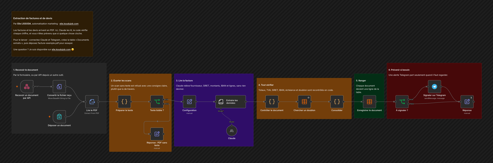

# Extraction de factures et de devis

Les factures et les devis arrivent en PDF. Ici, Claude les lit, le code vérifie chaque chiffre, et vous n'êtes prévenu que si quelque chose cloche.

## Comment il fonctionne

1. **Recevoir le document.** Par le formulaire, ou par API depuis un autre outil.
2. **Écarter les scans.** Un scan sans texte est refusé avec une consigne claire, plutôt que lu de travers.
3. **Lire la facture.** Claude relève fournisseur, SIRET, montants, IBAN et lignes, sans rien deviner.
4. **Tout vérifier.** Totaux, TVA, SIRET, IBAN, échéance et doublon sont recontrôlés en code.
5. **Ranger.** Chaque document devient une ligne de la table.
6. **Prévenir si besoin.** Une alerte Telegram part seulement quand il faut regarder.

Testé sur [facture-exemple.pdf](facture-exemple.pdf), une facture fictive dont le total TTC est volontairement faux : l'écart a été repéré et signalé.

## Pour l'installer

1. Créez vos identifiants Anthropic et Telegram.
2. Dans Configuration, réglez `seuil_validation`, `ecart_tolere` et `telegram_chat_id`.
3. Créez la table n8n « Documents extraits » avec les colonnes recu_le, fichier, type_document, fournisseur, siret, numero, date_emission, date_echeance, montant_ht, tva, montant_ttc, devise, iban, statut, anomalies, lignes.
4. Importez `workflow.json`, choisissez votre table dans les deux nœuds de table, puis déposez `facture-exemple.pdf` dans le formulaire.

---

Un souci pour l'installer, ou une question ? Je suis disponible sur [elie.koudujob.com](https://elie.koudujob.com) 😉

**Elie LISSODA**
