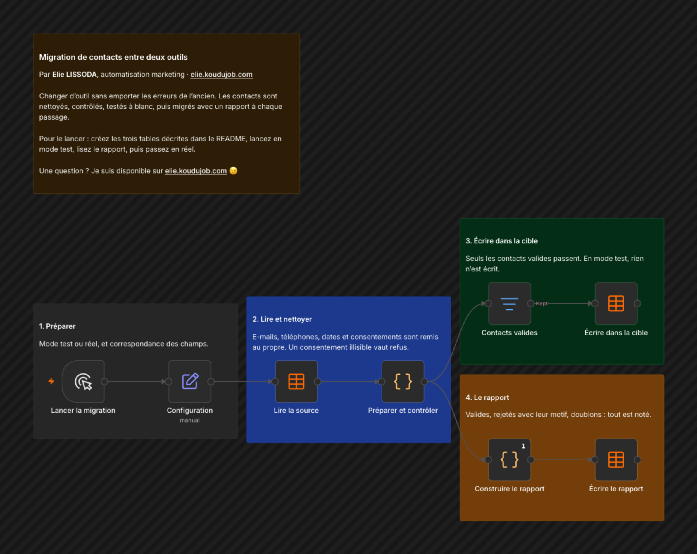

# Migration de contacts entre deux outils

Changer d'outil sans emporter les erreurs de l'ancien. Les contacts sont nettoyés, contrôlés, testés à blanc, puis migrés avec un rapport à chaque passage.

## Comment il fonctionne

1. **Préparer.** Mode test ou réel, et correspondance des champs.
2. **Lire et nettoyer.** E-mails, téléphones, dates et consentements sont remis au propre. Un consentement illisible vaut refus.
3. **Écrire dans la cible.** Seuls les contacts valides passent. En mode test, rien n'est écrit.
4. **Le rapport.** Valides, rejetés avec leur motif, doublons : tout est noté.

Je l'ai testé sur 12 contacts volontairement mal saisis : 8 migrés, 4 rejetés avec leur motif, 1 doublon repéré.

## Pour l'installer

1. Créez trois tables n8n :

   | Table | Colonnes |
   |---|---|
   | Migration contacts source | external_id, prenom, nom, email, telephone, pays, optin_email, optin_sms, langue, date_inscription, segment |
   | Migration contacts cible | external_id, first_name, last_name, email, phone, country, email_subscribed, sms_subscribed, language, created_at, segment, run_id |
   | Migration rapport | run_id, run_at, mode, total, valides, rejetes, doublons, champs_non_mappes, details |

2. Dans Configuration, réglez `mode` (test ou reel), `mapping`, `champs_obligatoires` et `pays_defaut`.
3. Importez `workflow.json` et choisissez vos tables. Aucun identifiant externe n'est nécessaire.
4. Avec de vrais outils, remplacez « Lire la source » et « Écrire dans la cible » par les nœuds de vos outils (HubSpot, Mailchimp, Brevo, fichier CSV). Les contrôles restent les mêmes.
5. Lancez d'abord en mode test, lisez le rapport, puis passez en `reel`.

---

Un souci pour l'installer, ou une question ? Je suis disponible sur [elie.koudujob.com](https://elie.koudujob.com) 😉

**Elie LISSODA**
