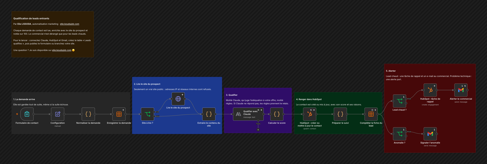

# Qualification de leads entrants

Chaque demande de contact est lue, enrichie avec le site du prospect et notée sur 100. Le commercial n'est dérangé que pour les leads chauds.

## Comment il fonctionne

1. **La demande arrive.** Elle est gardée tout de suite, même si la suite échoue.
2. **Lire le site du prospect.** Seulement un vrai site public : adresses IP et réseaux internes sont refusés.
3. **Qualifier.** Moitié Claude, qui juge l'adéquation à votre offre, moitié règles. Si Claude ne répond pas, les règles prennent le relais.
4. **Ranger dans HubSpot.** Le contact est créé ou mis à jour, avec son score et ses raisons.
5. **Alerter.** Lead chaud : une tâche de rappel et un e-mail au commercial. Problème technique : une alerte part.

Testé sur des demandes simulées.

## Pour l'installer

1. Créez la table n8n « Leads qualifies » :

   | Colonne | Type |
   |---|---|
   | submitted_at | Date |
   | full_name, email, company, website, job_title, company_size, need, budget, timeline | Texte |
   | score | Nombre |
   | segment, reasons, next_action, hubspot_id, error | Texte |
   | alert_sent | Booléen |

2. Créez un identifiant Anthropic, un identifiant Gmail, et une application privée HubSpot qui peut lire et écrire les contacts et les tâches (son jeton va dans un identifiant « HubSpot App Token »).
3. Dans Configuration, décrivez votre offre et votre client idéal, puis réglez le seuil du lead chaud et les e-mails du commercial et de l'administrateur.
4. Importez `workflow.json`, choisissez votre table et publiez. Partagez l'adresse du formulaire, ou remplacez-le par un Webhook relié à votre site.

Chaque demande consomme un appel à Claude, facturé sur votre compte Anthropic.

---

Un souci pour l'installer, ou une question ? Je suis disponible sur [elie.koudujob.com](https://elie.koudujob.com) 😉

**Elie LISSODA**
