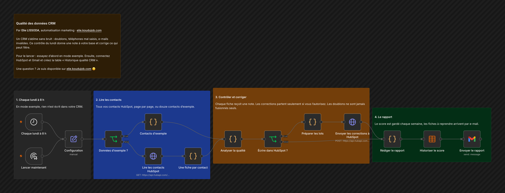

# Qualité des données CRM

Un CRM s'abîme sans bruit : doublons, téléphones mal saisis, e-mails invalides. Ce contrôle du lundi donne une note à votre base et corrige ce qui peut l'être.

## Comment il fonctionne

1. **Chaque lundi à 8 h.** En mode exemple, rien n'est écrit dans votre CRM.
2. **Lire les contacts.** Tous vos contacts HubSpot, page par page, ou douze contacts d'exemple.
3. **Contrôler et corriger.** Chaque fiche reçoit une note. Les corrections partent seulement si vous l'autorisez. Les doublons ne sont jamais fusionnés seuls.
4. **Le rapport.** Le score est gardé chaque semaine, les fiches à reprendre arrivent par e-mail.

Testé sur les contacts d'exemple : 2 groupes de doublons, 10 téléphones remis au format international, 2 e-mails invalides et 3 fiches incomplètes repérés. Note de la base : 83 sur 100.

## Pour l'installer

1. Laissez `mode_demo` sur vrai et lancez « Lancer maintenant » : les douze contacts d'exemple suffisent pour voir le rapport.
2. Pour votre base, créez un jeton d'application privée HubSpot qui peut lire et modifier les contacts, et connectez Gmail.
3. Créez la table n8n « Historique qualité CRM » avec les colonnes date, source, contacts, score, doublons, emails_a_corriger, telephones_normalises, fiches_incompletes, corrections_appliquees.
4. Passez `mode_demo` à faux. Laissez `appliquer_corrections` à faux tant que vous n'avez pas relu un premier rapport.

---

Un souci pour l'installer, ou une question ? Je suis disponible sur [elie.koudujob.com](https://elie.koudujob.com) 😉

**Elie LISSODA**
