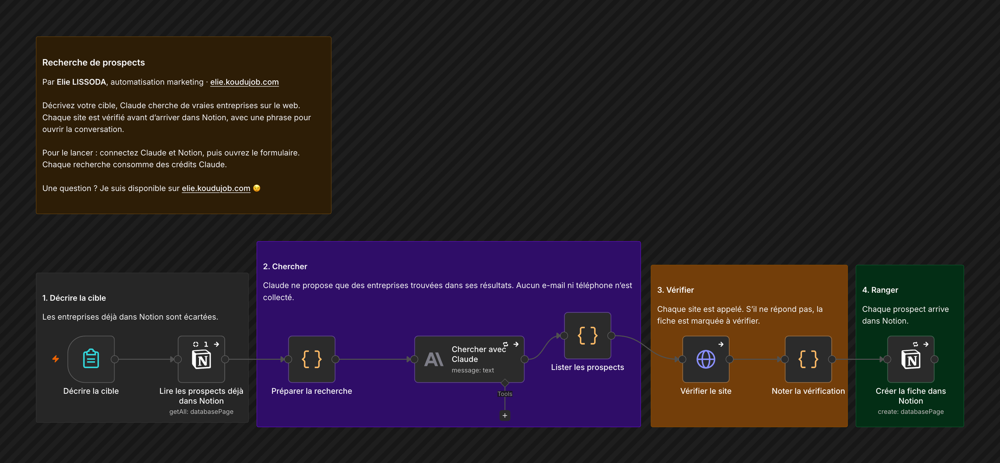

# Recherche de prospects

Décrivez votre cible, Claude cherche de vraies entreprises sur le web. Chaque site est vérifié avant d'arriver dans Notion, avec une phrase pour ouvrir la conversation.

## Comment il fonctionne

1. **Décrire la cible.** Les entreprises déjà dans Notion sont écartées.
2. **Chercher.** Claude ne propose que des entreprises trouvées dans ses résultats. Aucun e-mail ni téléphone n'est collecté.
3. **Vérifier.** Chaque site est appelé. S'il ne répond pas, la fiche est marquée à vérifier.
4. **Ranger.** Chaque prospect arrive dans Notion.

Testé en vrai : 5 agences immobilières indépendantes de Lyon trouvées, vérifiées et rangées dans Notion en une minute.

## Pour l'installer

1. Préparez une base Notion :

   | Colonne | Type |
   |---|---|
   | Nom | Titre |
   | Statut | Sélection : À contacter, Site à vérifier, Contacté, Erreur |
   | Pertinence | Nombre |
   | Site, Source | URL |
   | Ville, Secteur, Signal, Décideur, Pourquoi, Angle, Recherche | Texte |
   | Date de recherche | Date |

2. Créez une intégration interne Notion, ajoutez-la à la page de la base, puis collez son jeton dans un identifiant « Notion API ».
3. Créez un identifiant Anthropic. La recherche web doit être autorisée dans la console Anthropic.
4. Importez `workflow.json`, choisissez votre base dans les deux nœuds Notion et publiez. Le formulaire reste réservé aux comptes de votre n8n.

Chaque recherche consomme des crédits Claude et des recherches web.

---

Un souci pour l'installer, ou une question ? Je suis disponible sur [elie.koudujob.com](https://elie.koudujob.com) 😉

**Elie LISSODA**
