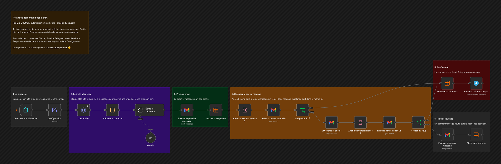

# Relances personnalisées par IA

Trois messages écrits pour un prospect précis, et une séquence qui s'arrête dès qu'il répond. Personne ne reçoit de relance après avoir répondu.

## Comment il fonctionne

1. **Le prospect.** Son nom, son site et ce que vous avez repéré sur lui.
2. **Écrire la séquence.** Claude lit le site et écrit trois messages courts, avec une vraie accroche et aucun lien.
3. **Premier envoi.** Le premier message part par Gmail.
4. **Relancer si pas de réponse.** Après 3 jours, puis 5, la conversation est relue. Sans réponse, la relance part dans le même fil.
5. **Il a répondu.** La séquence s'arrête et Telegram vous prévient.
6. **Fin de séquence.** Un dernier message court, puis la séquence est close.

## Pour l'installer

1. Créez vos identifiants Anthropic, Gmail et Telegram.
2. Dans Configuration, mettez votre signature, votre offre, les deux délais et `telegram_chat_id`.
3. Créez la table n8n « Séquences de relance » avec les colonnes demarre_le, email, entreprise, thread_id, etape, statut.
4. Importez `workflow.json`, choisissez votre table dans les trois nœuds de table et activez le workflow. Faites un premier essai vers votre propre adresse.

---

Un souci pour l'installer, ou une question ? Je suis disponible sur [elie.koudujob.com](https://elie.koudujob.com) 😉

**Elie LISSODA**
