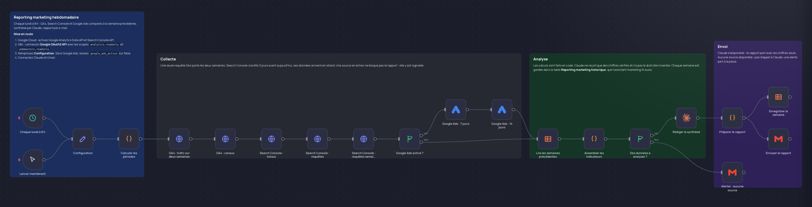

# Reporting marketing hebdomadaire

Chaque lundi à 8 h, GA4, Search Console et Google Ads sont comparés à la semaine précédente. Les calculs sont faits en code, Claude rédige la synthèse à partir de ces chiffres, l'historique est gardé et le rapport part par e-mail.

## Le problème

Le point hebdomadaire prend une demi-journée : exporter trois outils, recopier, comparer, rédiger. Et une IA à qui l'on confie des exports bruts invente parfois des chiffres ou compare des périodes qui ne se correspondent pas.

## Le résultat

- Une seule requête GA4 porte les deux semaines : sessions, utilisateurs, taux d'engagement, conversions clés, puis le détail par canal.
- Search Console : clics, impressions, CTR, position moyenne, les 10 premières requêtes, les 5 qui gagnent et les 5 qui perdent des clics. La fenêtre est décalée de 3 jours, le temps que les données arrivent.
- Google Ads en option : dépense et interactions des 7 derniers jours, comparées aux 7 jours précédents.
- Claude ne reçoit que des chiffres calculés et vérifiés. Ses règles : n'en inventer aucun, nommer la source de chacun, séparer les faits des hypothèses, ne pas commenter une variation trop faible pour être un signal.
- Le rapport contient le titre de la semaine, ce qui a bougé, les points de vigilance, 3 actions et le tableau des indicateurs avec leurs variations en couleur.
- Chaque semaine est gardée dans une table n8n et relue les semaines suivantes pour donner la tendance.
- Une source en panne est signalée dans le rapport sans le bloquer. Si aucune ne répond, Claude n'est pas appelé et une alerte part à la place.

Testé sur des données simulées.

## Les nœuds

| Nœud | Rôle |
|---|---|
| Chaque lundi à 8 h, Lancer maintenant | Passage automatique chaque semaine, ou lancement à la main |
| Configuration | Ton site, ta propriété GA4, ta propriété Search Console, Google Ads oui ou non, l'e-mail du destinataire |
| Calculer les périodes | Semaine écoulée, semaine précédente et fenêtres décalées de Search Console |
| GA4 : trafic sur deux semaines, GA4 : canaux | Deux requêtes à l'API Google Analytics Data |
| Search Console : totaux, requêtes, requêtes semaine précédente | Trois requêtes à l'API Search Console |
| Google Ads activé ?, Google Ads : 7 jours, Google Ads : 14 jours | Dépense et interactions des campagnes, seulement si Google Ads est activé |
| Lire les semaines précédentes | Les 6 dernières semaines de l'historique |
| Assembler les indicateurs | Tous les calculs et comparaisons, sources indisponibles comprises |
| Des données à analyser ? | Arrête tout si aucune source n'a répondu |
| Rédiger la synthèse | Claude Opus 5, réponse en JSON : titre, faits, alertes, actions |
| Préparer le rapport | Construit l'e-mail HTML et la ligne d'historique |
| Enregistrer la semaine, Envoyer le rapport | Historique dans la table, rapport par Gmail |
| Alerter : aucune source | E-mail d'alerte quand aucune source n'a répondu |

## Configuration

1. **Google Cloud** : active Google Analytics Data API et Search Console API dans ton projet.
2. **Connexion Google** : crée un identifiant « Google OAuth2 API » avec les scopes `analytics.readonly` et `webmasters.readonly`. Pour Google Ads, crée aussi un identifiant Google Ads.
3. **Table n8n** « Reporting marketing historique » avec ces colonnes :

   | Colonne | Type |
   |---|---|
   | run_id, top_queries, summary | Texte |
   | period_start, period_end | Date |
   | sessions, users, key_events, engagement_rate, sessions_change | Nombre |
   | gsc_clicks, gsc_impressions, gsc_ctr, gsc_position, gsc_clicks_change | Nombre |
   | ads_cost, ads_clicks | Nombre |

4. **Configuration** : ton site, l'identifiant de ta propriété GA4, ta propriété Search Console (par exemple `sc-domain:tondomaine.fr`), `google_ads_active` sur true ou false, tes identifiants de compte Google Ads et l'e-mail du destinataire.
5. **Claude et Gmail** : crée un identifiant « Anthropic » et un identifiant Gmail OAuth2.
6. **Import** : importe `workflow.json`, choisis ta table dans les 2 nœuds de table, rattache tes identifiants et publie.

Chaque rapport consomme un appel à Claude, facturé sur ton compte Anthropic.
