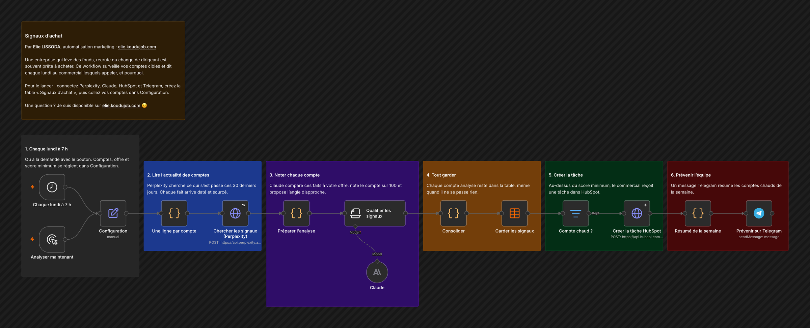

# Signaux d'achat

Une entreprise qui lève des fonds, recrute ou change de dirigeant est souvent prête à acheter. Ce workflow surveille vos comptes cibles et dit chaque lundi au commercial lesquels appeler, et pourquoi.

## Comment il fonctionne

1. **Chaque lundi à 7 h.** Ou à la demande avec le bouton. Comptes, offre et score minimum se règlent dans Configuration.
2. **Lire l'actualité des comptes.** Perplexity cherche ce qui s'est passé ces 30 derniers jours. Chaque fait arrive daté et sourcé.
3. **Noter chaque compte.** Claude compare ces faits à votre offre, note le compte sur 100 et propose l'angle d'approche.
4. **Tout garder.** Chaque compte analysé reste dans la table, même quand il ne se passe rien.
5. **Créer la tâche.** Au-dessus du score minimum, le commercial reçoit une tâche dans HubSpot.
6. **Prévenir l'équipe.** Un message Telegram résume les comptes chauds de la semaine.

Testé en réel sur 20 entreprises lyonnaises : 36 signaux datés et sourcés en 77 secondes, 2 comptes chauds repérés.

## Pour l'installer

1. Créez vos identifiants : Perplexity, Anthropic, HubSpot (jeton d'application privée qui peut créer des tâches) et Telegram.
2. Dans Configuration, collez vos comptes (une ligne par entreprise : `Nom | domaine`), décrivez votre offre, puis réglez `score_minimum` et `telegram_chat_id`.
3. Créez la table n8n « Signaux d'achat » avec les colonnes detecte_le, entreprise, score, types, signaux, raison, angle_approche, sources.
4. Importez `workflow.json`, choisissez votre table, puis lancez « Analyser maintenant ».

---

Un souci pour l'installer, ou une question ? Je suis disponible sur [elie.koudujob.com](https://elie.koudujob.com) 😉

**Elie LISSODA**
