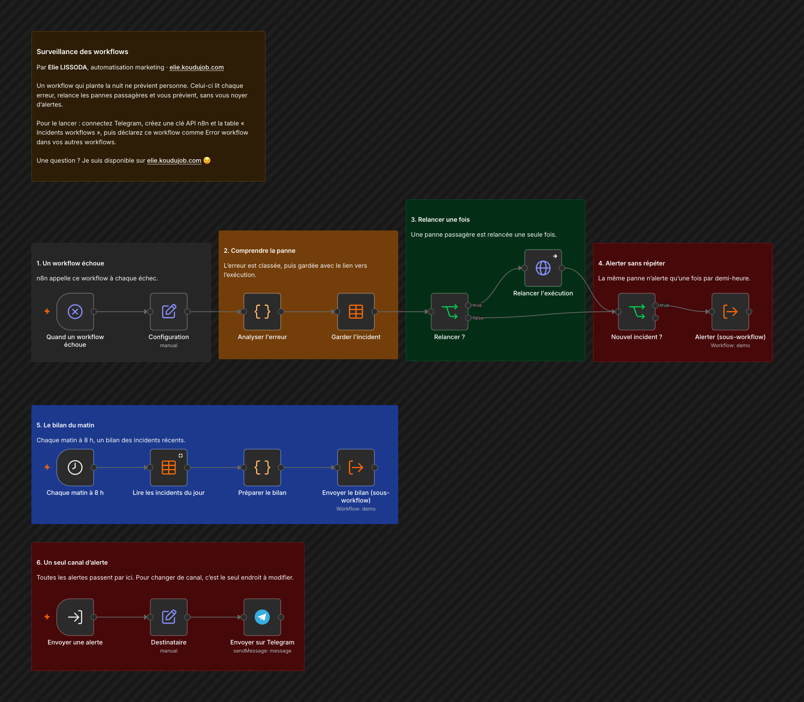

# Surveillance des workflows

Un workflow qui plante la nuit ne prévient personne. Celui-ci lit chaque erreur, relance les pannes passagères et vous prévient, sans vous noyer d'alertes.

## Comment il fonctionne

1. **Un workflow échoue.** n8n appelle ce workflow à chaque échec.
2. **Comprendre la panne.** L'erreur est classée, puis gardée avec le lien vers l'exécution.
3. **Relancer une fois.** Une panne passagère est relancée une seule fois.
4. **Alerter sans répéter.** La même panne n'alerte qu'une fois par demi-heure.
5. **Le bilan du matin.** Chaque matin à 8 h, un bilan des incidents récents.
6. **Un seul canal d'alerte.** Toutes les alertes passent par ici. Pour changer de canal, c'est le seul endroit à modifier.

Testé avec une erreur simulée : incident classé, gardé dans la table, alerte reçue sur Telegram.

## Pour l'installer

1. Créez un identifiant Telegram, et une clé dans Settings, n8n API, pour la relance automatique.
2. Dans Destinataire, indiquez votre identifiant de conversation Telegram.
3. Créez la table n8n « Incidents workflows » avec les colonnes survenu_le, workflow, noeud, type, message, execution_id, lien, relance.
4. Importez `workflow.json`, choisissez votre table et activez le workflow. Dans les réglages de chaque workflow à surveiller, choisissez-le comme « Error workflow ».

---

Un souci pour l'installer, ou une question ? Je suis disponible sur [elie.koudujob.com](https://elie.koudujob.com) 😉

**Elie LISSODA**
