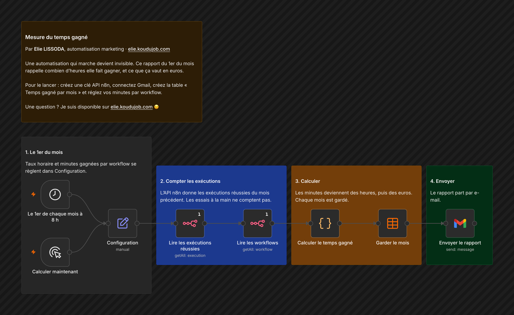

# Mesure du temps gagné

Une automatisation qui marche devient invisible. Ce rapport du 1er du mois rappelle combien d'heures elle fait gagner, et ce que ça vaut en euros.

## Comment il fonctionne

1. **Le 1er du mois.** Taux horaire et minutes gagnées par workflow se règlent dans Configuration.
2. **Compter les exécutions.** L'API n8n donne les exécutions réussies du mois précédent. Les essais à la main ne comptent pas.
3. **Calculer.** Les minutes deviennent des heures, puis des euros. Chaque mois est gardé.
4. **Envoyer.** Le rapport part par e-mail.

## Pour l'installer

1. Créez une clé dans Settings, n8n API, puis un identifiant « n8n API » avec cette clé. Connectez aussi Gmail.
2. Dans Configuration, réglez `taux_horaire`, `minutes_par_defaut`, `minutes_par_workflow` (une ligne par workflow : `Nom du workflow | minutes`) et `report_email`.
3. Créez la table n8n « Temps gagné par mois » avec les colonnes mois, executions, heures, valeur_euros, detail.
4. Importez `workflow.json`, choisissez votre table, puis lancez « Calculer maintenant » pour un premier rapport.

---

Un souci pour l'installer, ou une question ? Je suis disponible sur [elie.koudujob.com](https://elie.koudujob.com) 😉

**Elie LISSODA**
