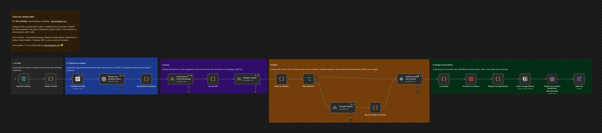

# Usine de contenu GEO

Chaque IA fait ce qu'elle fait le mieux : Perplexity trouve les faits, ChatGPT les vraies questions des gens, Claude écrit, Gemini vérifie. Vous recevez un article sourcé, prêt à relire.

## Comment il fonctionne

1. **Le brief.** La question du client, la marque, le ton et la note minimale à atteindre.
2. **Chercher la matière.** Perplexity rapporte les faits récents avec leurs sources, ChatGPT les questions que les gens posent vraiment.
3. **Écrire.** Claude fait d'abord un plan argumenté, puis écrit l'article avec sa FAQ et son balisage JSON-LD.
4. **Relire.** L'article est noté sur 100. En dessous de la note minimale, Claude le reprend. Gemini vérifie ensuite chaque chiffre avec Google.
5. **Ranger les brouillons.** L'article part en brouillon dans WordPress et dans Notion. Rien n'est publié sans relecture.

## Pour l'installer

1. Créez vos identifiants : Perplexity, OpenAI, Anthropic, Google Gemini, WordPress et Notion.
2. Créez la table n8n « Contenus GEO » avec les colonnes cree_le, question, marque, titre, meta, score, corrige, constats, article_html, jsonld, sources, verification, mots.
3. Dans Notion, préparez une base avec les propriétés Marque, Question, Meta, Points_restants, Verification (texte), Note, Mots (nombre), Corrige (case à cocher), Statut (sélection) et Cree_le (date).
4. Importez `workflow.json`, choisissez le modèle Perplexity, votre table et votre base Notion, puis ouvrez l'adresse du formulaire.

---

Un souci pour l'installer, ou une question ? Je suis disponible sur [elie.koudujob.com](https://elie.koudujob.com) 😉

**Elie LISSODA**
