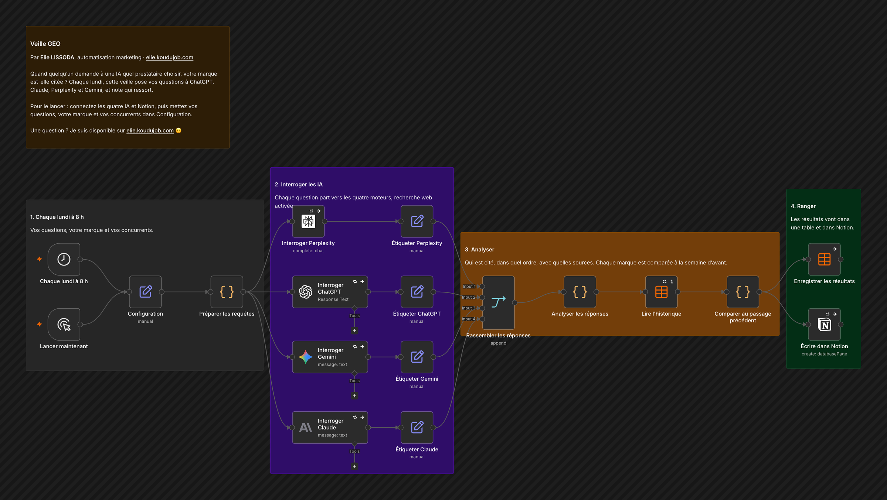

# Veille GEO

Quand quelqu'un demande à une IA quel prestataire choisir, votre marque est-elle citée ? Chaque lundi, cette veille pose vos questions à ChatGPT, Claude, Perplexity et Gemini, et note qui ressort.

## Comment il fonctionne

1. **Chaque lundi à 8 h.** Vos questions, votre marque et vos concurrents.
2. **Interroger les IA.** Chaque question part vers les quatre moteurs, recherche web activée.
3. **Analyser.** Qui est cité, dans quel ordre, avec quelles sources. Chaque marque est comparée à la semaine d'avant.
4. **Ranger.** Les résultats vont dans une table et dans Notion.

Testé en vrai : n8n face à Make et Zapier, 3 questions posées aux 4 IA, 12 réponses analysées en 4 minutes.

## Pour l'installer

1. Dans Configuration, indiquez votre marque et ses variantes (`brand`, `aliases`, `domains`), vos concurrents (un par ligne : `Nom | domaine | variantes`) et vos questions (une par ligne, comme vos clients les posent).
2. Créez la table n8n « Veille GEO resultats » :

   | Colonne | Type |
   |---|---|
   | run_id, brand, engine, prompt, competitors_mentioned, status, answer_excerpt, sources, error | Texte |
   | run_at | Date |
   | mentioned, cited | Booléen |
   | citation_rank | Nombre |

3. Préparez une base Notion :

   | Colonne | Type |
   |---|---|
   | Titre | Titre |
   | Moteur | Sélection : ChatGPT, Claude, Perplexity, Gemini |
   | Statut | Sélection : visible, apparu, absent, disparu, erreur |
   | Marque citée | Case à cocher |
   | Position, Rang dans les sources | Nombre |
   | Question, Ordre de mention, Détail par marque, Concurrents cités, Sources, Erreur | Texte |
   | Date | Date |

4. Créez une intégration interne Notion, ajoutez-la à la page de la base, puis collez son jeton dans un identifiant « Notion API ».
5. Créez un identifiant pour chaque IA : Anthropic (recherche web autorisée dans la console), OpenAI, Perplexity et Google Gemini.
6. Importez `workflow.json`, choisissez votre table et votre base, lancez « Lancer maintenant », puis publiez pour le passage du lundi.

Les réponses des IA varient d'une semaine à l'autre : la veille prend tout son sens quand on la suit dans la durée.

---

Un souci pour l'installer, ou une question ? Je suis disponible sur [elie.koudujob.com](https://elie.koudujob.com) 😉

**Elie LISSODA**
